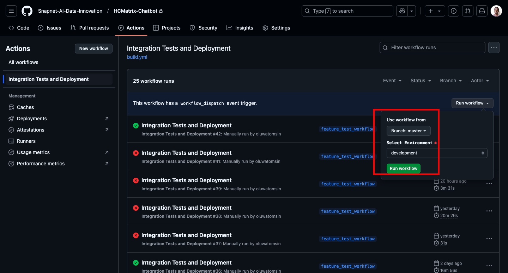
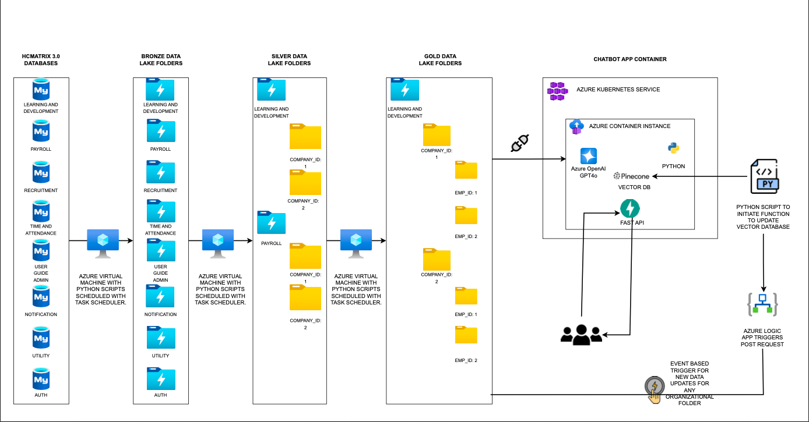

# HC-Matrix-Chatbot

## Description
HC-Matrix-Chatbot is a chatbot designed for users onboarded into the HC-Matrix platform. It allows employees to inquire about their personal information and company-wide policies.

## Repository
[GitHub Repository](https://github.com/Data-Analytics-AI/HCMatrix-Chatbot-New.git)

## Features
- **Conversational AI:** Employees can ask about their personal information and company policies.
- **Speech Synthesis:** Generates and streams speech audio responses.
- **Chat History Management:** Fetch past conversations for context.
- **Fast and Efficient API:** Uses FastAPI and ORJSON for high performance.
- **Asynchronous Processing:** Optimized for speed with async MongoDB queries.
- **Secure Authentication:** Uses Azure Key Vault for credential management.

## Installation
1. Clone the repository:
   ```sh
   git clone https://github.com/Data-Analytics-AI/HCMatrix-Chatbot-New.git
   ```
2. Navigate to the project directory:
   ```sh
   cd HCMatrix-Chatbot-New
   ```
3. Install dependencies:
   ```sh
   pip install -r requirements.txt
   ```
4. Set environment variables (ensure `.env` is properly configured).
5. Start the application:
   ```sh
   uvicorn main:app --host 0.0.0.0 --port 5000
   ```

## API Endpoints
| Method | Endpoint              | Description |
|--------|-----------------------|-------------|
| POST   | `/chat`               | Get chatbot response (text only) |
| POST   | `/audio`              | Generate and stream speech audio |
| GET    | `/chat-history`       | Fetch chat history for a given chat session |
| GET    | `/all-chat-history`   | Fetch all chat history for a user |

## Deployment
Deployment to both staging and production is handled by `build.yml` in GitHub Actions.



## Architecture
The chatbot follows the architecture shown below:



## Additional Documentation
- **Speech Synthesis Feature:** See [`module/spk.md`](module/spk.md) for more details.
- **Kubernetes Setup:** See [`k8.setup.md`](k8.setup.md) for Kubernetes deployment information.

